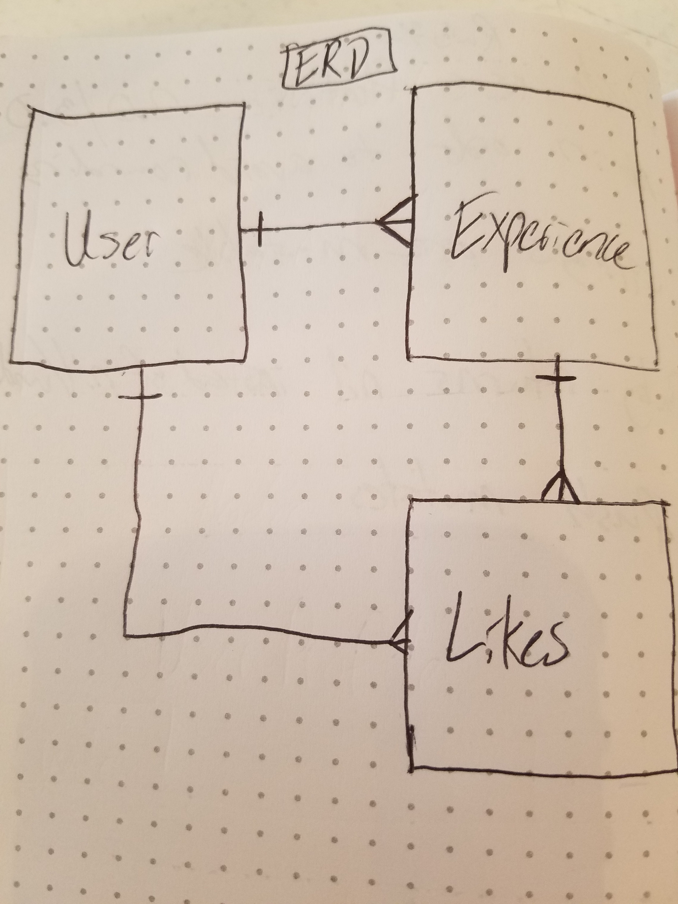
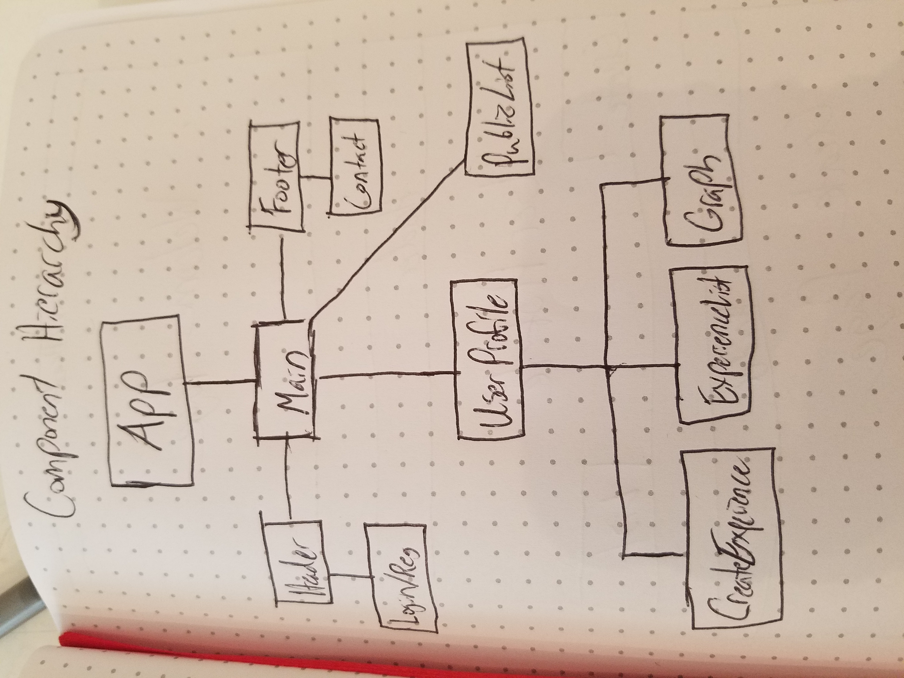
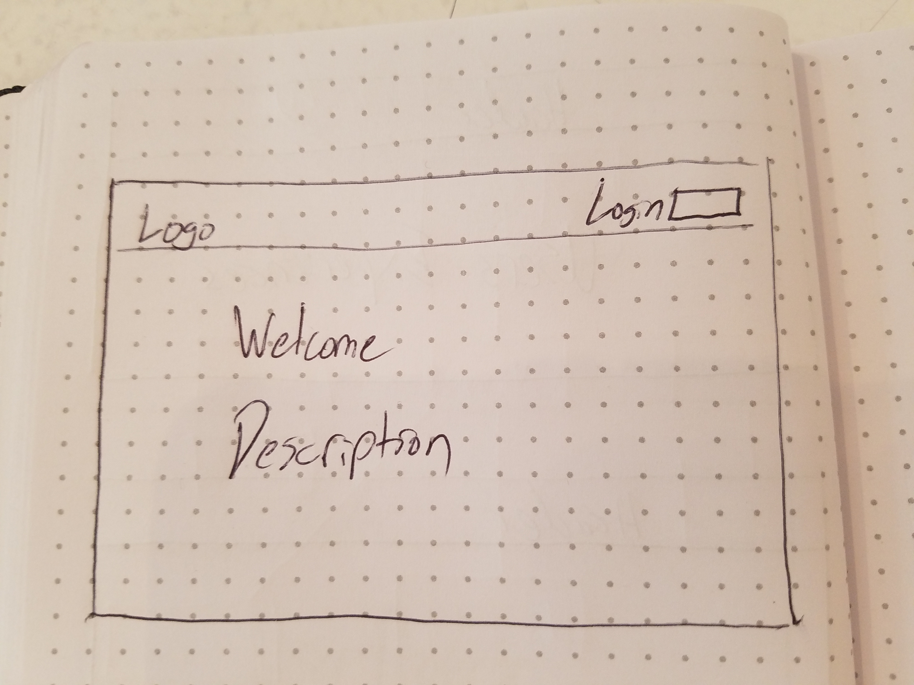
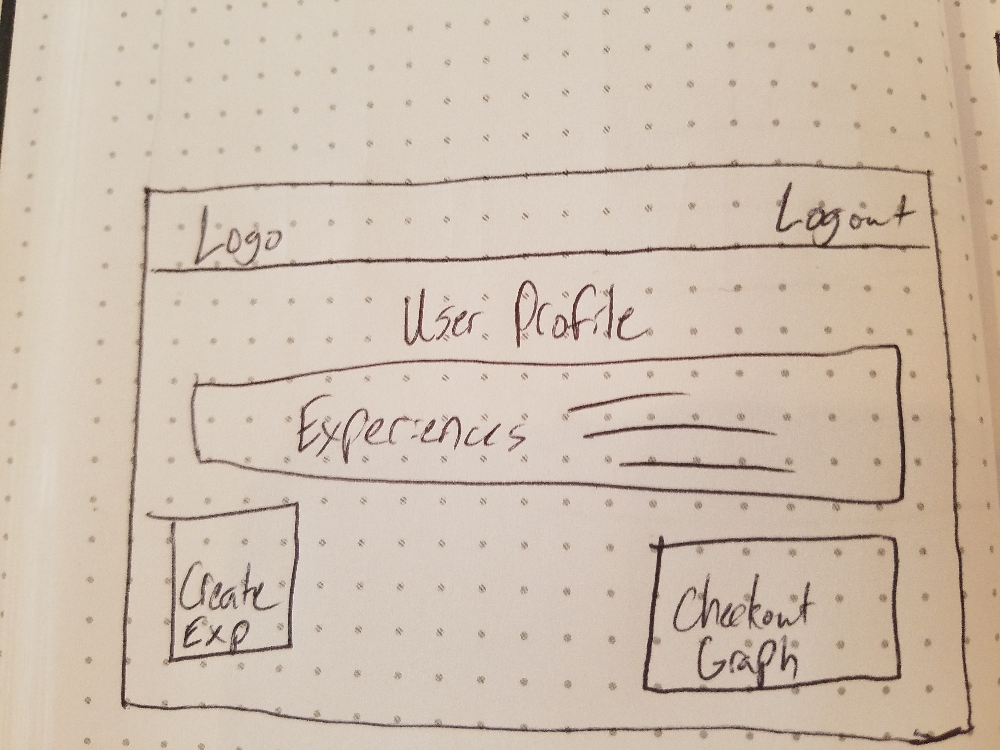
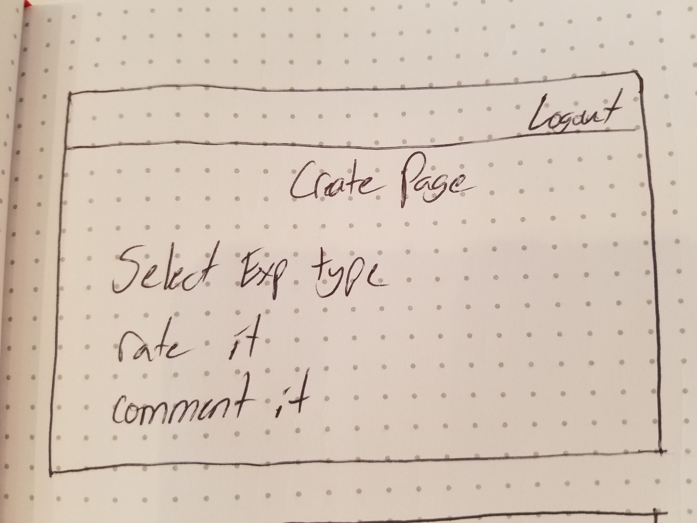
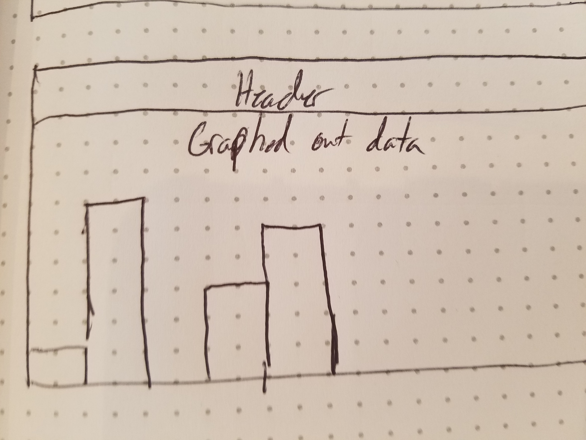

# Anxiety Manager

## Project Description

Anxiety Manager is a web app intended to aid users in introspecting about their every day anxieties. Using user input I plan to quantify and graph out their daily patterns of anxiety. The hope is that by doing this, the user will see patterns about themselves and their anxieties in a readable and understandable way so that they might change their thought patterns.

## Objectives

My biggest goal with this project was to make a front-end feature filled project. My intention with this was to make an app that felt as close to a real app experience as I could create. Conditionally rendering random sets of messages based off of time of day, greetings depending whether or not the user is just trying out the app for the first time and many other small details.

## Challenges Faced

- Implementing all of the conditional rendering
- Creating a means of updating the graph in real time as a user inputs new data
- Creating user auth in a new backend language proved itself to be more challenging than expected

## Installation Instructions

- Fork and clown down repo
- Run bundle install in root directory
- Cd into client
- Run npm install
- Cd ..
- Open the code in a text editor
- Open the api.js in client/services and change the BASE_URL to "http://localhost3000"
- In the root directory of the terminal, run rails db:create, rails db:migrate, rails db:reset
- Run rails s
- Open a new tab, cd into client
- run npm start
- You should be good to go, get hacking!

## Code Snippet

```const { experiences, currentUser, popup, morning_messages, afternoon_messages, night_messages } = props
const now = new Date().getHours();
const random = (arr) => {
  const num = (Math.floor(Math.random() * Math.floor(arr.length)))
  return num
}

<div className="greet-user">
  { now >= 0 && now < 12 && <p>Good morning {props.currentUser.username}!</p>}
  { now >= 3 && now < 12 &&<p>{morning_messages[random(morning_messages)]}</p>}
  { now >= 12 && now <= 21 && <p>Good Afternoon {props.currentUser.username}!</p>}
  { now >= 12 && now <= 21 && <p>{afternoon_messages[random(afternoon_messages)]}</p>}
  { now >= 21 && <p>Long day {props.currentUser.username}?</p>}
  { now >= 21 && <p>{night_messages[random(night_messages)]}</p>}
  {experiences.length === 0 && <div>To get started, talk about your problems here &#x2193;</div>}
  {experiences.length === 1 && <div>Great! You've created your first post, come back anytime!</div>}
</div>```

## ERD



## Component Hierarchy



## Wireframes






## MVP

- Create user auth
- Give users the ability to rate an experience they had
- Generate an average rating of a users experiences
- Graph out the users list of experiences and show trends

### PostMVP

- Create public and private posts
- Create user likes for others experiences *if the post is public*

## Expected Issues

- Creating a collection of all of the data that can be graphed out
- Graphing out the data

## Technologies Used

- React, Rails, Material UI, Chartkick
